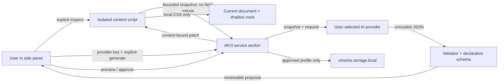

# Architecture

## Trust boundaries

The AI response is always untrusted. It cannot supply JavaScript, HTML, remote URLs, event handlers, or arbitrary CSS declarations. It can only suggest constrained numeric/enum settings and a short list of conservative selectors.

## Permission model

The installed permissions are `activeTab`, `scripting`, `sidePanel`, and `storage`.

- `activeTab` permits a temporary inspection/preview only after the toolbar action.
- `scripting` injects the locally packaged adaptation runtime.
- `sidePanel` hosts the accessible conversation UI.
- `storage` keeps provider credentials and approved profiles on the device.
- `http://*/*` and `https://*/*` are declared as optional host capabilities because users may approve any site or supported provider, but Chrome grants only the exact origin requested at runtime.

Approved origins receive two persistent, origin-scoped, document-start content registrations: a main-world shadow-root hook and an isolated content script. Chrome persists dynamic registrations across sessions.

## Request lifecycle and stale-result defense

1. The content script creates a random document token.
2. It creates another random navigation token and rotates it when an SPA changes URL.
3. The service worker adds the active tab ID and exact URL.
4. The snapshot carries that complete context.
5. Any new navigation or request aborts the previous provider fetch.
6. After the provider responds, the service worker re-reads the live page context.
7. Preview, undo, and save each re-check the same context again.
8. The content script independently rejects an application message whose tokens or URL do not match.

This is defense in depth: cancellation improves responsiveness, while identity checks provide correctness even if cancellation races.

## Profile lifecycle

Profiles are keyed by exact origin and stored locally with a versioned schema. Saving registers persistent scripts only after Chrome confirms access to that origin. At document start, the isolated script asks the service worker for the matching profile and reapplies it. The page never receives provider credentials or direct storage access.

## Shadow DOM

Normal document CSS does not cross shadow boundaries. The main-world hook wraps `attachShadow`, retains each returned root (including closed roots), and installs a local style inside it. The bridge accepts only the already constrained adaptation shape and carries no page data or secrets. Existing open roots are discovered; closed roots created before injection remain inaccessible until a permitted reload enables document-start injection.

## Performance budget

- No polling timers.
- One lightweight URL-change observer per permitted page.
- Page extraction capped at 18,000 characters, 60 headings, 30 landmarks, and 100 controls.
- Profile lookup is one local storage read per document or same-document navigation.
- Shadow-root work occurs only on root creation or adaptation changes.
