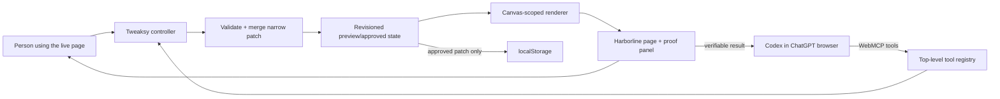

# Tweaksy Live — WebMCP Challenge solution plan

**Status:** Implemented and prepared for deployment

**Prepared:** August 28, 2026

**Submission deadline:** September 3, 2026 at 1:00 p.m. PDT / 11:00 p.m. IDT

**Pre-challenge baseline:** `37cac55` (`Rebrand and extend Tweaksy extension`, July 31, 2026)
**Primary references:** [OpenAI Site Tools documentation](https://learn.chatgpt.com/docs/webmcp), [OpenAI challenge page](https://openai.com/webmcp-challenge/), [binding Devpost rules](https://webmcp.devpost.com/rules)

## 1. Recommendation

Build **Tweaksy Live**, a hosted, static WebMCP companion experience in this repository.

Tweaksy Live will present an original fictional reading surface and expose Tweaksy's safe adaptation operations directly to Codex through WebMCP. Codex interprets the person's natural-language intent; the page validates and applies only bounded visual changes. The person sees the same live artifact, tests a temporary preview, refines it, and controls what becomes persistent.

The concise product pitch is:

> Tweaksy makes a fixed interface negotiable. An agent can act only through safe adaptation primitives, while the person sees, refines, and approves every lasting change.

This should be a companion proof of the extension's core interaction model, not a rushed port of the entire extension and not an extension-only submission.

## 2. Why this is the right submission shape

The challenge requires a working, judge-accessible WebMCP web app. A hosted first-party page is materially easier to test and evaluate than an unpacked browser extension.

| Option | Assessment | Decision |
|---|---|---|
| Add WebMCP only to the extension | Judges would need to install it; page ownership and registration are ambiguous; no simple live URL | Reject for the challenge MVP |
| Import arbitrary third-party pages | Cross-origin restrictions, iframe tool-discovery limits, IP risk, and unreliable demos | Reject |
| Build a full hosted Tweaksy SaaS | Adds accounts, backend, AI-provider integration, and deployment risk without improving the core demo | Reject |
| Hosted Tweaksy Live companion | Meets the live-URL requirement, reuses trusted domain logic, and makes human-agent collaboration visible | **Choose** |

The extension remains the broader product vision: eventually Tweaksy can bring this adaptation model to permitted sites. The challenge entry proves the WebMCP interaction safely on an owned surface.

## 3. Problem and audience

Most websites ship one fixed visual interface. Browser zoom and fixed accessibility settings help, but people may still need a combination of changes such as larger type, shorter line lengths, reduced motion, stronger focus indicators, a different color treatment, or a one-item-at-a-time reading layout.

Agents can understand such intent, but controlling a page through brittle clicks or generated CSS is hard to verify and easy to get wrong. Tweaksy exposes a small, validated vocabulary of visual operations and keeps the resulting state visible and reversible.

The initial audience is people who benefit from personal display adjustments, especially readers managing visual strain, motion sensitivity, attention load, keyboard navigation, or color-vision preferences. The product should describe preferences and outcomes without making medical claims.

## 4. Hero experience

### Hosted surface

Create a fictional publication called **Harborline Journal** with six original stories. The initial layout should feel credible and moderately dense, with a navigation bar, story cards, an optional sidebar, imagery, and subtle motion. It should remain fundamentally usable; Tweaksy demonstrates personalization rather than repairing an intentionally broken page.

Everything must be in the top-level document. The current ChatGPT browser does not discover WebMCP tools registered in iframes.

### Persistent Tweaksy dock

Keep a compact Tweaksy state dock outside the adaptable canvas. It remains visually stable while the publication changes and contains:

- Mascot state: Ready, Preview, Saved, or Error.
- Explicit phase: **Original**, **Preview — temporary**, or **Saved locally**.
- Changed-field chips, such as `Story deck`, `Text +20%`, and `Reduced motion`.
- Measured preservation evidence, such as `Stories 6 → 6`, `Links 6 → 6`, and `Hidden content 0`.
- A bounded, expandable “Validated patch” view.
- **Approve & save**, **Undo preview**, and **Reset demo** controls.
- A short activity log identifying human and agent actions.
- A clear “Site tools ready” or fallback status.

The Tweaksy dock and the WebMCP handlers must call the same controller. There should be one state machine, two callers, and one visible result.

### Primary user journey

1. The person opens Tweaksy Live in the ChatGPT desktop app's browser.
2. The person asks Codex:

   > Busy pages overwhelm me. Reorganize this into one story at a time, make the text easier to read, reduce motion, and keep every story and link keyboard-accessible.

3. Codex inspects the surface and current revision through WebMCP.
4. Codex calls the preview tool with a narrow partial adaptation.
5. The page visibly becomes a swipeable story deck with larger type, improved spacing, reduced motion, side navigation, and strong focus indicators.
6. The proof panel verifies that all six stories and links remain available.
7. The person tests the page and asks:

   > Keep this preview, but make the images smaller and place each Read story link at the bottom.

8. Codex sends an incremental preview rather than replacing the established design.
9. The person clicks the visible **Approve & save** button. If the P1 approval tool ships, an explicit “save it” instruction can exercise the same controller instead.
10. A refresh proves that only the approved profile persists.
11. The person asks what is saved and whether anything disappeared; Codex reads the current state and reports measured evidence.

## 5. Product scope

### P0 — submission-critical

- One original, polished Harborline Journal surface.
- One dramatic, complete story-deck transformation.
- Font scale, line height, content width, heading tone, color scheme, higher contrast, reduced motion, strong focus, color-vision mode, image size, side controls, and link placement.
- Validated incremental previews.
- Preview, approve/save, undo-preview, reset, and reload persistence.
- A visible state/diff/proof dock.
- Imperative, top-level WebMCP tool registration.
- Graceful human UI when WebMCP is unavailable.
- Static production build and public live URL.
- Unit tests, real-browser smoke test, and submission documentation.

### P1 — only after P0 is stable

- WebMCP approval tool in addition to the human approval button.
- Export of a saved `.tweaksy.json` design.
- Extra accessibility measurements or a before/after comparison overlay.
- Automated browser smoke test.

### Explicitly out of scope

- Embedded chat or a second OpenAI API integration.
- User-supplied API keys or provider settings.
- Arbitrary URLs, scraping, third-party pages, or iframes.
- Accounts, backend services, databases, cloud sync, or multi-user collaboration.
- Voice input.
- Sharing/import workflows beyond a possible P1 export.
- Arbitrary CSS, HTML, JavaScript, URLs, or selectors from an agent.
- Chrome Web Store publication.
- Multiple demo sites or shallow preset galleries.

## 6. Solution architecture



Architectural principle:

> The agent never generates or executes presentation code. It selects from a typed adaptation vocabulary; Tweaksy owns validation, rendering, measurement, preview, and persistence.

### Proposed repository shape

```text
src/
  types.ts                         # reuse
  validation.ts                    # reuse
  patch-merge.ts                   # reuse
  web/
    main.ts                        # boots page, controller, and tools
    adaptation-controller.ts       # single state machine
    demo-renderer.ts               # scoped Harborline renderer
    surface-inventory.ts           # objective counts and measurements
    storage.ts                     # approved-profile localStorage adapter
    webmcp.ts                      # tool definitions and registration
    webmcp-types.d.ts              # minimal document.modelContext typing
web/
  index.html
  app.css
  assets/
scripts/
  build-web.mjs
tests/
  web-adaptation-controller.test.ts
  web-tool-input.test.ts
  webmcp-registration.test.ts
dist-web/                          # generated static deployment output
```

### Build strategy

- Keep the existing extension build behavior intact.
- Add `build:web`, `dev:web`, and `check:web` package scripts.
- Use the repository's existing TypeScript, esbuild, Vitest, and brand assets.
- Build a static `dist-web/` artifact with relative asset paths.
- Add no framework, server, database, authentication, or runtime secret.

### Direct reuse

- `AdaptationPatch`, `DEFAULT_PATCH`, field enums, and change detection from `src/types.ts`.
- Patch validation and normalization from `src/validation.ts`.
- Incremental merge/reset behavior from `src/patch-merge.ts`.
- Existing brand assets, mascot states, language, and accessibility conventions.
- Existing deck interaction patterns and design tokens where they can be cleanly scoped.

### Deliberate non-reuse

- Do not import `background.ts`, `profile-store.ts`, `registration.ts`, or Chrome extension messaging.
- Do not import `provider.ts`; Codex supplies the intelligence through WebMCP.
- Do not port `sidepanel.ts`; it is tightly coupled to extension messaging and would duplicate the agent chat.
- Do not import `content.ts`; it is an extension-scoped IIFE coupled to `chrome.runtime`, arbitrary-page extraction, and navigation tokens.
- Do not inject `buildAdaptationCss()` unchanged because it targets `html`, `body`, and `:root` and could modify Tweaksy's review controls. Build a small canvas-scoped renderer using the same validated model.

## 7. State and consent model

```ts
type TweaksyLivePhase = "original" | "preview" | "saved";

interface TweaksyLiveState {
  schemaVersion: 1;
  revision: number;
  approvedPatch: AdaptationPatch;
  preview: {
    id: string;
    patch: AdaptationPatch;
    summary: string;
    createdAt: string;
  } | null;
  lastReport: AdaptationVerification | null;
  lastOperation: {
    source: "human" | "agent";
    action: string;
    at: string;
  } | null;
  activity: Array<{
    source: "human" | "agent";
    action: string;
    at: string;
  }>; // bounded to the latest 10 entries
}
```

Rules:

- `effectivePatch = preview?.patch ?? approvedPatch`.
- A preview is temporary and remains in memory only.
- Approval moves the exact current preview into `approvedPatch` and persists that validated patch.
- Reload discards any unapproved preview and restores the last approved patch.
- Undo preview clears only the unapproved preview and restores the approved state.
- Resetting an approved profile is an explicit action; it is never inferred from missing fields.
- Every mutation increments a monotonic revision.
- Mutating WebMCP calls include `expectedRevision` or `previewId` and reject stale operations.
- Persisted data is validated again during startup before rendering.
- No mutation can introduce raw CSS, HTML, scripts, URLs, or arbitrary selectors.

State flow:

```text
Original ──preview──> Temporary preview ──approve──> Saved
Saved ─────preview──> Temporary preview
Temporary preview ──discard──> Previous approved state
Saved ─────explicit reset──> Original
```

## 8. WebMCP tool contract

Register tools imperatively from JavaScript in the top-level page using `document.modelContext.registerTool`. Use feature detection, register once, set `additionalProperties: false`, describe side effects plainly, and return canonical state plus verification evidence.

### P0 tools

| Tool | Kind | Purpose |
|---|---|---|
| `inspect_tweaksy_surface` | Read-only | Returns the semantic story inventory, supported adaptations, objective counts, current phase, and revision. |
| `get_tweaksy_state` | Read-only | Returns the approved/preview state, changed fields, current revision, last report, and recent activity. |
| `preview_tweaksy_adaptation` | Temporary reversible write | Validates and incrementally merges a narrow patch, renders it, measures the result, and marks approval as required. |
| `discard_tweaksy_preview` | Restorative write | Removes only the current unapproved preview and restores the approved state. |

### P1 tool under review

| Tool | Kind | Purpose |
|---|---|---|
| `approve_tweaksy_preview` | Persistent local write | Saves only the exact current `previewId`; it cannot introduce or alter an adaptation patch. It runs only after an explicit user request and coexists with the human approval button. |

The recommended consent default is to ship the visible human **Approve & save** control first. Add the approval tool only after the preview and verification loop is stable. This preserves Tweaksy's strongest trust boundary while leaving a complete agent-driven path available as a measured P1 addition.

### Preview input shape

The tool accepts a partial delta rather than a full design. Its JSON schema must constrain numeric ranges and enum values and reject unknown keys.

```ts
type WebAdaptationField = Exclude<AdaptationField, "hideSelectors">;

interface PreviewAdaptationInput {
  expectedRevision: number;
  summary: string; // bounded plain text
  changes: {
    fontScale?: number;
    lineHeight?: number;
    letterSpacingEm?: number;
    contentMaxWidthRem?: number;
    headingColor?: "black" | "navy" | "teal" | "white";
    articleLayout?: "unchanged" | "swipe-cards";
    deckControls?: "unchanged" | "sides";
    deckImageSize?: "unchanged" | "compact";
    deckLinkPosition?: "unchanged" | "footer";
    colorVisionMode?: "unchanged" | "avoid-red";
    themePreset?: "unchanged" | "warm-hospitality" | "clean-minimal" | "bold-dark" | "paper-editorial";
    colorScheme?: "unchanged" | "light" | "dark";
    contrast?: "unchanged" | "more";
    reduceMotion?: boolean;
    strongFocus?: boolean;
  };
  resetFields?: WebAdaptationField[]; // the exposed fields above; never hideSelectors
}
```

Do not expose `hideSelectors`. If hiding a demo region later becomes essential, expose a separate semantic enum such as `"decorative-promo"` and map it to a page-owned allowlist internally.

### Required mutation result

Every mutation returns enough evidence to verify the visible effect rather than merely reporting success.

```json
{
  "phase": "preview",
  "previewId": "generated-id",
  "revision": 3,
  "approvalRequired": true,
  "changedFields": ["articleLayout", "fontScale", "reduceMotion"],
  "normalizedPatch": {},
  "verification": {
    "storiesBefore": 6,
    "storiesAfter": 6,
    "linksBefore": 6,
    "linksAfter": 6,
    "hiddenContent": 0,
    "keyboardNavigation": true
  },
  "normalizations": []
}
```

If values are clamped, normalized, ignored, or rejected, return that explicitly. Agent-supplied summaries are bounded and rendered with `textContent`, never `innerHTML`.

## 9. Renderer and verification design

The renderer acts only inside `[data-tweaksy-demo]`. The Tweaksy dock, tool-status banner, and review controls remain outside this boundary.

Implementation behavior:

- Source story data uses stable IDs and original owned text/assets.
- The story-deck transformation moves or re-renders those same six records; it does not fetch content.
- Each card remains keyboard reachable and keeps its “Read story” link.
- Side controls, arrow keys, and touch/drag navigation are supported.
- Reduced-motion mode disables nonessential animation and smooth scrolling.
- Focus indicators never depend on color alone.
- A preview fully replaces the previous preview, while incremental patch merging preserves established settings.
- The renderer returns a structured application report based on actual DOM counts.

Minimum verification measurements:

- Story count before and after.
- Story-link count before and after.
- Hidden-content count.
- Changed-field list.
- Active layout and theme.
- Keyboard navigation availability.
- Whether the rendered state matches the controller revision.

## 10. Security and privacy boundaries

- Treat WebMCP inputs and outputs as untrusted.
- Use strict schemas and reject unknown properties.
- Reuse Tweaksy validation and patch-merge logic.
- Accept no raw CSS, HTML, JavaScript, remote URLs, event handlers, or arbitrary selectors.
- Keep all state and rendering local to the page.
- Make no provider or third-party API calls.
- Store only the approved normalized patch in `localStorage`.
- Keep preview and approval separate.
- Require revision/preview identity for mutations.
- Return measured evidence of each state change.
- Keep the normal human interface fully usable without WebMCP.
- Avoid third-party marks, copied layouts, copyrighted music, and unlicensed assets in the app and video.

## 11. Testing and acceptance criteria

### Automated P0 tests

- Tool adapter rejects unknown keys and unsupported enum values.
- Numeric inputs are bounded and canonical results are returned.
- Unsafe CSS-like values, HTML, URLs, and selectors cannot reach the renderer.
- Incremental preview preserves established settings.
- Explicit resets work for nullable, boolean, and enum fields.
- No-op previews fail clearly rather than claiming a change.
- Preview creation increments revision and returns a unique preview ID.
- Stale revisions and stale preview IDs are rejected.
- Undo preview restores the approved state exactly.
- Approval persists only the current validated preview.
- Corrupted local storage is ignored safely.
- A fake `document.modelContext` captures the expected registrations, schemas, annotations, handlers, and verification payloads.
- Extension build and tests continue to pass.
- Web build succeeds independently.

### Browser acceptance

- Human UI works with no `document.modelContext` support.
- Keyboard-only preview review, approval, undo, and deck navigation work.
- Reduced-motion behavior is visible and respects user preference.
- The app remains usable at 200% browser zoom.
- WebMCP tools appear in ChatGPT's Available site tools.
- Real flow succeeds in the latest ChatGPT desktop app with GPT-5.6 Sol or Terra.
- Real flow succeeds in Chrome 149+ with `chrome://flags/#enable-webmcp-testing`.
- Read → preview → refinement → approval → reload → state verification matches the demo script.
- The public production URL behaves exactly like the recorded build.

### Definition of done

- Public live URL requires no payment, extension, or credentials.
- Public repository contains all source, assets, build instructions, and a detectable open-source license.
- The repository visibly contains top-level `document.modelContext.registerTool` usage.
- README/HACKATHON documentation distinguishes pre-existing and challenge-period work.
- Baseline-to-final comparison is easy for judges to inspect.
- Demo is coherent, polished, and not dependent on an unstated feature.

## 12. Delivery plan

### Phase 0 — review and evidence baseline (August 28)

- Review and approve this solution map.
- Register for the challenge.
- Decide repository visibility, license, hosting provider, and team/owner.
- Record `37cac55` as the pre-challenge baseline.
- Create a dedicated challenge branch without rewriting history.
- Add `HACKATHON.md` with a pre-existing/new-work matrix.

**Exit:** scope is approved and evidence strategy is in place before code changes.

### Phase 1 — static product shell (August 28–29)

- Add independent web build and local development command.
- Build Harborline Journal and the persistent Tweaksy dock.
- Add the scoped controller, renderer, and local storage adapter.
- Implement original, preview, saved, undo, and reset states using human controls.

**Exit:** a coherent human-only Tweaksy Live app builds and runs locally.

### Phase 2 — WebMCP core (August 29–30)

- Add top-level feature-detected registration.
- Implement inspect, state, preview, and discard tools.
- Enforce strict schemas, revisions, and verification payloads.
- Add registration and controller unit tests.

**Exit:** a shim test and a real supported browser can perform inspect → preview → refine → discard.

### Phase 3 — hero transformation and polish (August 30–31)

- Complete the one-story-at-a-time deck.
- Add compact media, footer link, side controls, focus, motion, and theme details.
- Complete preservation metrics, activity log, status language, responsive behavior, and accessibility QA.
- Decide whether the P1 approval tool improves the consent story enough to ship.

**Exit:** the complete hero journey works without debug intervention.

### Phase 4 — deployment and hardening (August 31–September 1)

- Deploy the static production artifact.
- Test the public URL in ChatGPT and Chrome 149+.
- Fix tool discovery, stale state, build, accessibility, and deployment issues.
- Add LICENSE, run instructions, architecture, tool table, exact judge prompts, and known limitations.

**Exit:** stable public URL, public repository, passing checks, and documented judge flow.

### Phase 5 — demo and submission (September 1–3)

- Draft the English Devpost description against all four judging criteria.
- Record a 2:30–2:50 narrated demo; never approach the strict three-minute limit.
- Upload the video publicly to YouTube.
- Create a final release/tag and record its commit SHA.
- Submit early, verify receipt, capture proof, and freeze the Devpost entry, repository, and deployment during judging.

**Internal target:** submit by September 3 at 6:00 p.m. IDT, leaving a five-hour safety buffer.

## 13. Three-minute demo map

| Time | Beat |
|---|---|
| 0:00–0:15 | Show the original publication and state the fixed-interface problem. |
| 0:15–0:35 | Show available Site Tools and ask the primary adaptation prompt. |
| 0:35–0:55 | Codex inspects and applies the temporary preview. |
| 0:55–1:15 | Navigate with the keyboard and show six stories and six links preserved. |
| 1:15–1:35 | Ask for compact images and footer links as an incremental refinement. |
| 1:35–1:50 | Show the refined preview and changed-field chips. |
| 1:50–2:05 | Human approves and saves the exact preview. |
| 2:05–2:20 | Refresh and show the approved design returning. |
| 2:20–2:40 | Ask Codex what is saved and whether anything disappeared; show verification. |
| 2:40–2:55 | Explain typed inputs, reversible preview, measured result, and explicit persistence. |
| 2:55 | End on “Tweaksy — The web, shaped for you.” |

## 14. Judging map

| Criterion | Evidence in the product and submission |
|---|---|
| WebMCP leverage | Multiple working read/write tools; top-level registration; strict typed deltas; shared revisioned state; incremental refinements; objective verification. |
| Execution | Polished hosted product; normal human UI; preview, approval, undo, persistence, errors, responsive design, and accessibility. |
| Potential impact | A specific audience and concrete cognitive/visual-load problem, with content preservation visibly demonstrated. |
| Creativity and ambition | Agent-assisted interface co-design through safe primitives, not another chatbot, theme picker, or brittle click automation. |

WebMCP leverage is also the first tie-break criterion, so tool quality and visible verification should take priority over adding unrelated features.

## 15. Compliance and evidence checklist

- [ ] Entrant/team eligibility and ownership are verified.
- [ ] Challenge registration is complete.
- [ ] Repository is public.
- [ ] Root LICENSE is recognized by GitHub and appropriate for all owners.
- [ ] `37cac55` is documented as the pre-challenge baseline.
- [ ] All challenge work is in normal dated commits after August 25 at 9:00 p.m. IDT.
- [ ] History is not squashed, amended, rebased, or backdated before judging.
- [ ] `HACKATHON.md` distinguishes old and new work and links the baseline comparison.
- [ ] Live URL is public, stable, free, and judge-accessible.
- [ ] All source, assets, and run instructions are present.
- [ ] All demo text, imagery, fonts, music, and marks are owned or properly licensed.
- [ ] Video is public, narrated, and strictly under three minutes.
- [ ] Video visibly shows WebMCP calls and resulting state changes.
- [ ] English description explains fit, improved UX, new collaboration, and implementation.
- [ ] Submission is received before September 3 at 11:00 p.m. IDT.
- [ ] Final repository, deployment, and Devpost entry are frozen during judging.

## 16. Main risks and mitigations

| Risk | Mitigation |
|---|---|
| WebMCP work appears bolted on | Make the inspect/preview/refine/verify loop the primary product journey and document post-baseline work. |
| Judge cannot access or discover tools | Use a static unauthenticated top-level page, supported models/browsers, visible readiness state, and exact test prompts. |
| Extension renderer causes regressions | Do not import it; add a small canvas-scoped renderer and keep the extension build unchanged. |
| Agent arguments mutate unsafe presentation details | Strict schemas, current validator/merger, semantic allowlists, and no raw CSS/HTML/URLs/selectors. |
| Agent and human race | Revision and preview identity checks on every mutation. |
| A clamped or partial result is misrepresented | Return the canonical patch, normalizations, objective counts, and applied revision. |
| Story deck consumes the schedule | Make the controlled six-story renderer the only dramatic transformation and cut secondary features. |
| Human consent story is weakened | Ship human approval first; any approval tool saves only an existing preview after explicit user intent. |
| Video or assets violate submission rules | Use original content/assets, no music, and a 2:30–2:50 narrated cut. |
| Existing-project work is not distinguishable | Preserve baseline SHA, granular dated commits, HACKATHON matrix, and final comparison/tag. |

## 17. Decisions required before implementation

1. **Public/open-source authorization:** Are we comfortable making this repository public and adding an open-source license? Recommended default: MIT, subject to owner approval.
2. **Hosting:** Recommended default: GitHub Pages for the static artifact; Cloudflare Pages or Vercel are alternatives if already connected.
3. **Approval boundary:** Recommended default: human button is P0; WebMCP approval tool is P1 and may only persist the current preview ID after explicit intent.
4. **Hero scope:** Recommended default: the story deck is P0 because it makes the entry more original than a font/theme picker.
5. **Name/content:** Recommended default: **Tweaksy Live** and **Harborline Journal**, using only original text and owned/generated assets.

Implementation should begin only after these decisions are reviewed.
